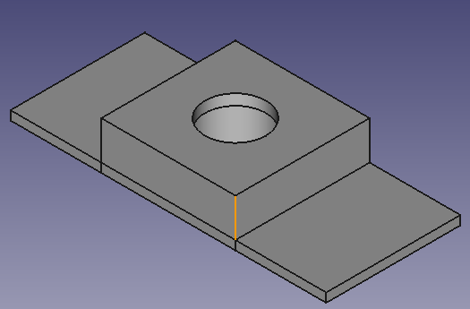
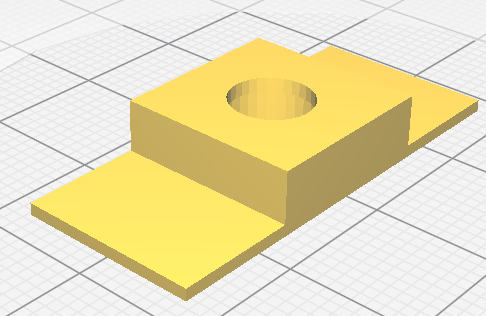
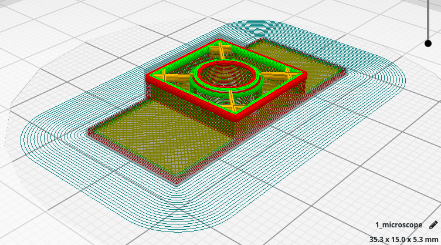

# 3D MICROSCOPE FOR SMARTPHONE'S CAMERA
Using a DVD reader lens you can become your smartphone's camera into a powerful microscope.
This 3d design helps you fixing the lens over your smartphone's camera.
You just need to put the lens inside the 3d microscope design and then put it all together over your camera.

## Release notes.
### Version 1.0.0
*  It has a semi conic shape inside to avoid lens get out itself.
* This version does not have yet a solution to be tightened to any smartphone. Actually you might use some tape to help the adjustment.

